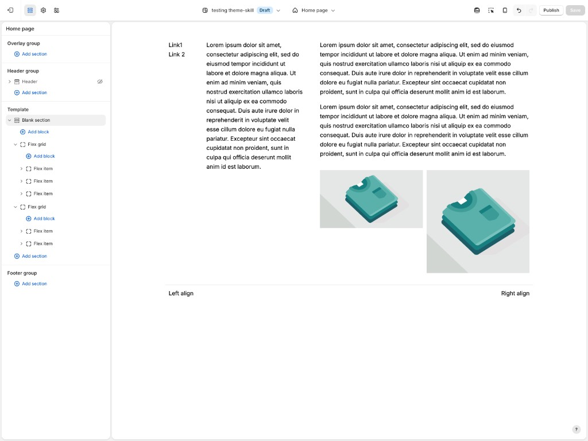

# Slab

This file holds bundled knowledge for the Slab Shopify theme. 

## Block reference

Curated Slab blocks for typical JSON templates: **layout** (full set), **content**, and **cards**. The JSON `type` is the basename of `blocks/<type>.liquid`. Always confirm against the **workspace** theme’s ``.

When the theme repo is open, listing `blocks/` is the source of truth for every block type; this README lists only common building blocks.

### Layout


| Role                  | JSON `type`       | Theme file                      |
| --------------------- | ----------------- | ------------------------------- |
| Grid                  | `layout__grid`    | `blocks/layout__grid.liquid`    |
| Grid cell             | `_g__grid-item`   | `blocks/_g__grid-item.liquid`   |
| Flex row/column       | `layout__flex`    | `blocks/layout__flex.liquid`    |
| Flex cell             | `_g__flex-item`   | `blocks/_g__flex-item.liquid`   |
| Slider                | `layout__slider`  | `blocks/layout__slider.liquid`  |
| Slide                 | `_g__slider-item` | `blocks/_g__slider-item.liquid` |
| Inline cluster        | `layout__inline`  | `blocks/layout__inline.liquid`  |
| Float                 | `layout__float`   | `blocks/layout__float.liquid`   |
| Marquee               | `layout__marquee` | `blocks/layout__marquee.liquid` |
| Tabs                  | `layout__tab`     | `blocks/layout__tab.liquid`     |
| Tab panel             | `_g__tab-item`    | `blocks/_g__tab-item.liquid`    |
| Table (layout)        | `layout__table`   | `blocks/layout__table.liquid`   |
| Table row             | `_g__table-row`   | `blocks/_g__table-row.liquid`   |
| Table cell            | `_g__table-cell`  | `blocks/_g__table-cell.liquid`  |
| Overlay / fixed layer | `layout__overlay` | `blocks/layout__overlay.liquid` |
| Container / frame     | `g__container`    | `blocks/g__container.liquid`    |
| Divider               | `divider`         | `blocks/divider.liquid`         |


### Content


| Role             | JSON `type`        | Theme file                       |
| ---------------- | ------------------ | -------------------------------- |
| Rich text        | `richtext`         | `blocks/richtext.liquid`         |
| Image            | `image`            | `blocks/image.liquid`            |
| Image comparison | `image-comparison` | `blocks/image-comparison.liquid` |
| Icon             | `icon`             | `blocks/icon.liquid`             |
| Button           | `g__button`        | `blocks/g__button.liquid`        |
| Video            | `g__video`         | `blocks/g__video.liquid`         |


### Cards


| Role            | JSON `type`          | Theme file                         |
| --------------- | -------------------- | ---------------------------------- |
| Product card    | `g__product-card`    | `blocks/g__product-card.liquid`    |
| Article card    | `g__article-card`    | `blocks/g__article-card.liquid`    |
| Collection card | `g__collection-card` | `blocks/g__collection-card.liquid` |


## Examples

### 3-column grid with image and button per column

Use this when you want equal-width columns driven by `layout__grid` with `row_desktop: 3`, repeating the same block pattern in each `_g__grid-item`.

**Structure:**

```
layout__grid (row_desktop: 3)
  └── _g__grid-item (×3)
      └── image
      └── g__button
```

**Illustrative nested block JSON** — [three-column-grid-image-button.json](three-column-grid-image-button.json) (verify types/settings in the target theme).

### Flex row with multiple items

Use this for row-based layouts where each column’s width is controlled on `_g__flex-item` (for example fractional or custom widths) instead of an implicit grid.

**Structure:**

```
layout__flex (direction: flex-row)
  └── _g__flex-item (×3)
      └── image
      └── richtext
```

**Illustrative nested block JSON** — [flex-row-multiple-items.json](flex-row-multiple-items.json) (verify types/settings in the target theme).

### Nested containers

Use this when a single grid or flex cell should wrap a shared inner frame (`g__container`) so spacing and grouping apply to several blocks together.

**Structure:**

```
_g__grid-item
  └── g__container (optional)
      └── image
      └── richtext
      └── g__button
```

**Illustrative nested block JSON** — [nested-containers.json](nested-containers.json) (verify types/settings in the target theme).

### 3-column flex, nested image grid, footer row




Two stacked flex layouts under one `section`—a main row with custom column widths (navigation column, bio column, wide column with stacked richtext and a nested two-cell image grid) and a footer row with a top border and split left/right richtext.

**Structure:**

```
section (type: section)
  ├── layout__flex (layout_flex_main_3col)
  │   ├── _g__flex-item (flex_item_nav_left)
  │   │   └── richtext
  │   ├── _g__flex-item (flex_item_bio_center)
  │   │   └── richtext
  │   └── _g__flex-item (flex_item_right_content)
  │       ├── richtext
  │       └── layout__grid (layout_grid_images)
  │           ├── _g__grid-item (grid_item_img_left) → image
  │           └── _g__grid-item (grid_item_img_right) → image
  └── layout__flex (layout_flex_footer_row)
      ├── _g__flex-item (flex_item_footer_left) → richtext
      └── _g__flex-item (flex_item_footer_right) → richtext
```

**Full section JSON** — [three-column-flex-nested-image-grid-footer-row.json](three-column-flex-nested-image-grid-footer-row.json) (verify types/settings in the target theme)